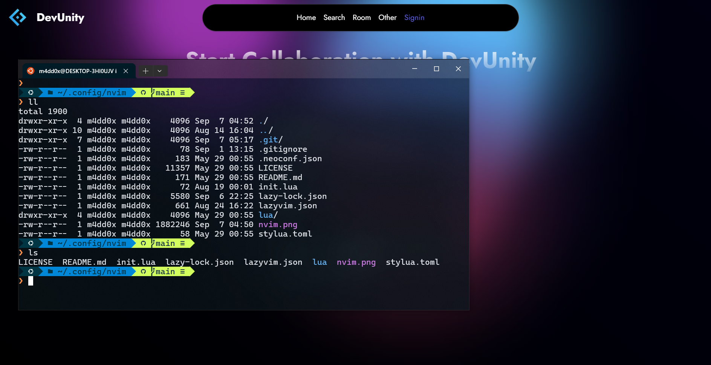

# m4dd0c's dotfiles inspired by Takuya

[Takuya Matsumaya](https://github.com/craftzdog/dotfiles-public)

## Contents

- Vim (Neovim) config
- Shell config

## Neovim setup

### Windows

- Neovim >= **0.9.0** (needs to be built with **LuaJIT**)
- Git >= **2.19.0** (for partial clones support)
- [Windows Terminal](https://apps.microsoft.com/detail/9n0dx20hk701?hl=en-US&gl=US) **_(Windows)_** - I use **oh-my-posh**
- [Chocolatey](https://docs.chocolatey.org/en-us/choco/setup/) - Package manager
- [Zig](https://ziglang.org/) - Cross Platform C-compiler for nvim-treesitter
  > `choco install zig`
- [LLVM](https://llvm.org/) - C-compiler for nvim-treesitter
  > `choco install llvm`
- [LazyVim](https://www.lazyvim.org/)
- [Nerd Font](https://www.nerdfonts.com/)(v3.0 or greater) **_(optional, but needed to display some icons)_**
- [lazygit](https://github.com/jesseduffield/lazygit) **_(optional)_**
- for [telescope.nvim](https://github.com/nvim-telescope/telescope.nvim) **_(optional)_**
  - **live grep**: [ripgrep](https://github.com/BurntSushi/ripgrep)
  - **find files**: [fd](https://github.com/sharkdp/fd)
    > `choco install ripgrep fd`
- [Solarized Osaka](https://github.com/craftzdog/solarized-osaka.nvim)

### WSL2

- WSL2
- Neovim >= **0.9.0** (needs to be built with **LuaJIT**)
- Git >= **2.19.0** (for partial clones support)
- Homebrew
- [LazyVim](https://www.lazyvim.org/)
- a [Nerd Font](https://www.nerdfonts.com/)(v3.0 or greater) **_(optional, but needed to display some icons)_**
- [lazygit](https://github.com/jesseduffield/lazygit) **_(optional)_**
- a **C** compiler for `nvim-treesitter`. See [here](https://github.com/nvim-treesitter/nvim-treesitter#requirements)
- for [telescope.nvim](https://github.com/nvim-telescope/telescope.nvim) **_(optional)_**
  - **live grep**: [ripgrep](https://github.com/BurntSushi/ripgrep)
  - **find files**: [fd](https://github.com/sharkdp/fd)
- a terminal that support true color and *undercurl*:
  - [Windows Terminal](https://apps.microsoft.com/detail/9n0dx20hk701?hl=en-US&gl=US) **_(Windows)_**
  - [wezterm](https://github.com/wez/wezterm) **_(Linux, Macos & Windows)_**
  - [alacritty](https://github.com/alacritty/alacritty) **_(Linux, Macos & Windows)_**
- [Solarized Osaka](https://github.com/craftzdog/solarized-osaka.nvim)
